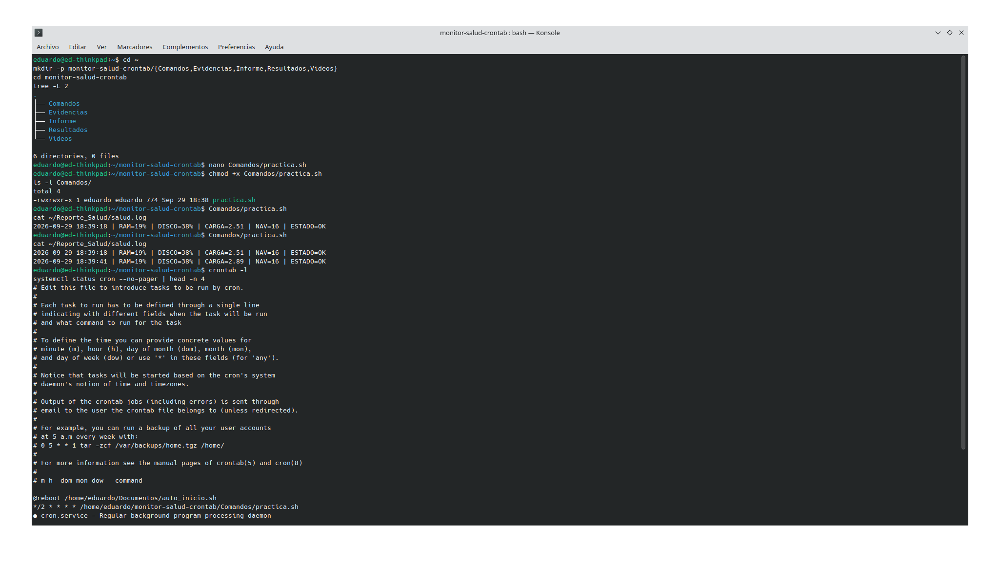
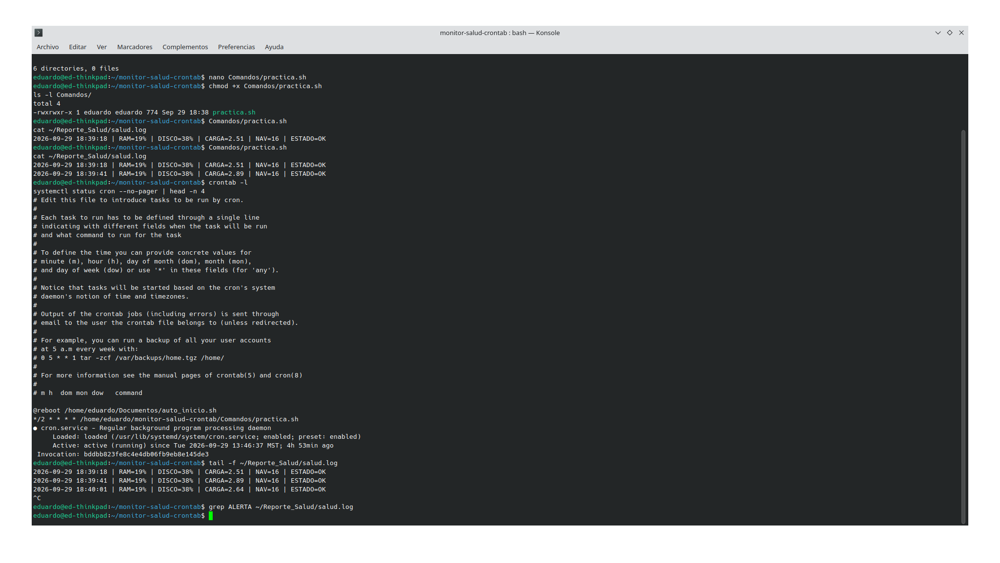

# Monitor de salud del sistema con crontab

Ejercicio de crontab en Kubuntu: script que se ejecuta en segundo plano cada 2 minutos y registra
la "salud" del equipo (RAM, disco, carga de CPU y procesos de navegador) en la carpeta personal del usuario.

## Descripción

El objetivo de esta práctica es aprender a programar tareas periódicas en Linux mediante `crontab`, usando
un script en Bash que recolecta métricas del sistema con los comandos `free`, `df`, `/proc/loadavg` y
`pgrep`, y las guarda en un log dentro de `~/Reporte_Salud/`.

## Objetivos de aprendizaje

Familiarizarse con la programación de tareas automáticas en Linux mediante `crontab -e` y la sintaxis
`*/2 * * * *`, comprendiendo cómo el demonio `cron` ejecuta scripts en segundo plano sin sesión de
terminal abierta, y cómo extraer y registrar el estado de recursos del sistema (memoria, disco y CPU)
usando comandos estándar.

## Material utilizado

- Laptop con el sistema operativo Kubuntu

## Informe

[Informe.pdf](Informe/Informe.pdf)

## Evidencias de la práctica





## Comandos

[practica.sh](Comandos/practica.sh)

Resumen de los comandos que usa el script:

| Comando | Para qué se usa |
|---|---|
| `free -m` | Memoria RAM en MiB (total y usada) para calcular el porcentaje |
| `df -P "$HOME"` | Porcentaje de uso del disco en la carpeta personal |
| `cat /proc/loadavg` | Carga promedio del sistema en el último minuto |
| `pgrep -c -f 'firefox\|chrome\|chromium'` | Cuenta procesos de navegador activos |
| `date '+%Y-%m-%d %H:%M:%S'` | Marca de tiempo de cada medición |
| `crontab -e` | Edita la tabla de tareas programadas del usuario |
| `crontab -l` | Lista las tareas programadas |
| `systemctl status cron` | Verifica que el servicio cron esté activo |

La línea programada con `crontab -e`:

```
*/2 * * * * /home/eduardo/monitor-salud-crontab/Comandos/practica.sh
```

## Video del funcionamiento

[Ver video en YouTube](https://youtu.be/CoqI8ExzxgA)

## Conclusiones

La práctica permitió reforzar el uso de `crontab` para automatizar tareas en segundo plano en Linux, así
como comprender el papel de comandos como `free`, `df` y `/proc/loadavg` para diagnosticar el estado de
un sistema. Se observó que cron ejecuta los scripts con un entorno mínimo (sin las variables de una sesión
interactiva), por lo que fue necesario definir el `PATH` dentro del script y usar rutas absolutas para que
la tarea funcionara correctamente. Durante el periodo monitoreado el equipo se mantuvo con una RAM baja
(19%) y sin alertas, lo que confirma que en condiciones normales de uso el sistema tiene margen de sobra
antes de acercarse al umbral crítico del 80%. También quedó claro que un uso alto de RAM no siempre es un
problema grave, ya que Linux aprovecha la memoria libre como caché de disco, y que los navegadores, por su
arquitectura multiproceso, suelen ser de los mayores consumidores de memoria en un equipo de escritorio. En
conjunto, la práctica reforzó la importancia de automatizar el monitoreo en vez de revisar el estado del
sistema manualmente.

## Resultados

[Resultados.md](Resultados/Resultados.md)
